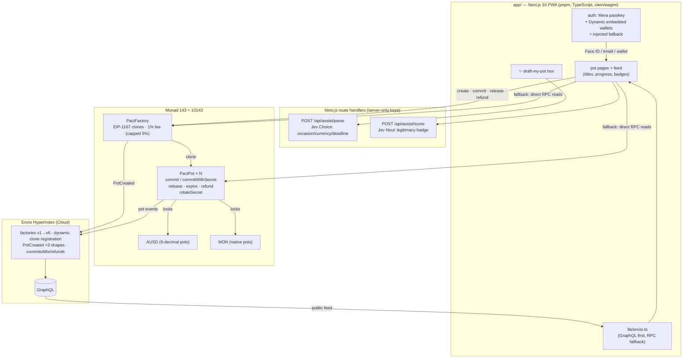

# WeMadeIt — money only moves if the group means it

**Live: https://wemadeit.vercel.app** · Track: **Consumer Products & Payments**
(Metropolis hackathon, Monad) · License: MIT.

## Thesis

**Problem.** Every informal organizer knows the script: you front the Airbnb, the
dinner bill, the group gift — then spend two weeks chasing friends across Venmo
requests. Half pay late, some never do, and asking a fourth time makes *you* the
bad guy. Splitwise records the debt after the fact. WeTravel/SquadTrip are built
for professional tour operators, with custodial holds and weeks-long payouts —
overkill for six friends. Crowdtilt proved people *want* threshold-based group
funding (it peaked near a $400M valuation), but custodial cards and Venmo killed it.

**What.** WeMadeIt turns an informal promise ("yeah, I'm in") into **programmable
group intent**: the organizer names a rule — *$X each, N people, by Friday* — and
shares a link. Contributions lock in non-custodial escrow. Hit the rule and the
organizer is paid automatically (**TILTED**). Miss it and everyone claims a
refund. **No tilt, no charge.**

**Why.** The failure isn't splitting — it's *commitment*. WeMadeIt answers "will
everyone actually pay?" *before* anyone is exposed, instead of documenting the
answer afterward.

**How (user flow).**
1. Organizer types one sentence *("cabin weekend, 6 of us, $80 each, by Friday")*
   → the form drafts itself → confirms → shares the link in the group chat.
2. Friends open the link, join with **Face ID** (no seed phrase, no app to
   install), see live faces + progress, and commit in one tap.
3. The progress bar *is* the reminder — social pressure replaces the awkward
   fourth text. Tilt → payout. Miss → one-tap refunds.

**Why now.** Three things converged: Monad makes $5–$50 conditional commits
economical (~$0.0001 actions, 600ms finality); passkeys (Mera) remove seed
phrases for normies; dollar stablecoins (AUSD, native OFT on Monad) remove
volatility from the conversation.

## Why Monad (genuine advantage, not a sticker)

- **Realtime social loop:** 400ms blocks mean commits land in under a second —
  the live progress bar that pressures the last two friends only works on fast
  finality.
- **Micro-escrow economics:** conditional $10 shares are viable at ~$0.0001 per
  action; on L1 gas they never were.
- **P256 precompile + Mera:** FaceID EOAs with zero contracts, bundlers, or
  custody backend.
- **AUSD (LayerZero OFT):** dollar-denominated pots; cross-chain friends bring
  the same dollar.
- **Envio HyperSync/HyperIndex:** realtime pot feed without running indexers
  (`indexer/`).

## Architecture



## Contracts (Sourcify `exact_match`, both chains)

**Discovery:** the home feed is search + filter over public pots (invite-only
pots never listed; titles stay public onchain, joining requires the key).

State machine: `commit()` → full? `release()` (permissionless, pays organizer) :
deadline passes? `expire()` → `refund()` (pull pattern, per contributor).
**Visibility:** public pots join via `commit()`; invite-only pots enforce
`commitWithSecret()` — the secret lives in the share-link `#fragment` (never
sent to servers), the chain stores only its hash; organizers can rotate it via
`rotateSecret()`. Verified on testnet: open commit reverts (`PrivateUseSecret`),
keyed commit lands.
Security properties, all covered by `forge test` (**16/16 green**): one commit
per address; organizer cannot touch funds pre-tilt; **fee (1%, capped 5%) is read
from the factory onchain — callers cannot waive it**; ReentrancyGuard +
checks-effects throughout; pot titles capped at 120 bytes.

No ceilings by design: party size and duration are unbounded (nothing loops over
them — a million-person fundraiser costs the same to create as a dinner pot).
Floors only: ≥2 people, amount above zero, deadline in the future.

| Chain | Factory (current, v6 — full history in `lib/monad.ts`) |
|---|---|
| Monad mainnet (143) | `0x910e17CC1Ea45B824E3Be700430E3F2cD29c5a4E` |
| Monad testnet (10143) | `0x2777C66CDE6C15D301cd0bf03C302b56E298e431` |

## Intelligence (TypeSafe, not hype)

Two narrow Jev judgments where semantics genuinely beat code; everything else
stays deterministic:

- **`POST /api/assist/parse`** — one sentence → structured draft. Closed sets
  (occasion, currency, deadline window) go to Jev as Choice questions; amounts
  and headcounts are extracted by regex in code; per-field confidence decides
  autofill vs. "please check" flags. Verified live: *"cabin weekend, 6 of us,
  $80 each, by Friday"* → trip / 3-day / 80 / 6.
- **`POST /api/assist/score`** — legitimacy Noul shown as a feed badge (cached
  per pot). Verified live: real pot → 0.76 "looks good"; *"FREE GIVEAWAY send 1
  MON get 10 back"* → **0.01** "check details".

API keys stay server-side; both routes degrade gracefully and the manual form is
always the source of truth.

## Auth (three paths, one pot)

1. **Face ID** — Mera passkeys, no seed phrase.
2. **Log in** — Dynamic modal: email, Google, or 580+ wallets → embedded wallet
   synced into wagmi.
3. **Wallet app** — injected fallback when Dynamic is unconfigured.

## Vision & roadmap

WeMadeIt starts as the commitment layer for informal groups and grows into group
treasury infrastructure:

- **Now (hackathon):** MON pots, FaceID + email login, tilt/refund, live demo.
- **Next:** AUSD pots (cross-border groups, no volatility); recurring pots
  (club dues, rent splits); organizer reputation; Envio-powered public feed with
  legitimacy badges; laggard nudges.
- **Later:** creator payouts (fans tilt a project into existence); event stake
  pots (Kickback-style attendance, same escrow); agent payers (AI agents commit
  to pots via ERC-8004 identity + the same contracts).

**Business model:** 1% fee on tilted pots (onchain, capped at 5%), free under a
threshold; pro tier for clubs/creators (recurring pots, custom branding,
analytics). Contra charges 0% and monetizes elsewhere; WeTravel takes cuts plus
holds — WeMadeIt is cheaper *and* non-custodial.

## Bounty alignment

- **Best Mera-Powered UX on Monad** — the whole product is the demo: open a
  link, Face ID, one tap to commit. No seed phrase, no extension, no chain
  jargon anywhere; the same passkey reproduces the account on every synced
  device (`category-labs/mera` SDK, BIP-39/44 derivation, session keys live
  only in page memory).
- **Mera: One Passkey, Many Keys** — one ceremony derives the EOA behind every
  action (create, commit, release, refund, rotation) via the deterministic PRF →
  HD path; first-visit creates, return visits sign in, cancel stays silent, and
  stale credentials degrade to plain-English recovery instead of dead ends.
- **Best Use of Dynamic** — email/social login via embedded wallets synced into
  wagmi, so every pot action works identically regardless of login path; single
  Log in entry, opening spinner, provisioning states, and the native
  account-linking panel for identity management.
- **Best Use of Envio** — HyperIndex (`indexer/`, live on Envio Cloud) tracks
  all six factory generations on both chains with dynamic clone registration
  (`contractRegister` on `PotCreated` → every pot's commits/tilts/refunds
  indexed; all three `PotCreated` shapes covered). The public feed reads one
  GraphQL query instead of per-factory RPC enumeration, with automatic RPC
  fallback and a `via Envio` provenance tag.
- **Best Cross-Border Payments App on Monad (Agora, $10k)** — AUSD pots:
  canonical AUSD on mainnet (`0x0000…9012a`) and testnet (`0xa901…22dC`),
  6-decimal math end to end (create/approve/commit/display), Face ID
  onboarding, ~600ms settlement. Verified: 25-AUSD pot created + committed on
  testnet. Any organizer anywhere collects borderless dollars; contributors
  join with one tap and no seed phrase.

## Run locally

```bash
cd contracts && forge test                      # 16/16
cd app && pnpm install && pnpm dev              # needs env below
```

Env (names only — values in `.env.local`, never committed):

| Var | Scope | Purpose |
|---|---|---|
| `NEXT_PUBLIC_CHAIN` | public | first-visit default chain (`mainnet`) |
| `NEXT_PUBLIC_DYNAMIC_ENV_ID` | public identifier | Dynamic login (abuse controlled by dashboard allowlists, not secrecy) |
| `NEXT_PUBLIC_MONAD_MAINNET_RPC` | public | QuickNode Pro endpoint (mainnet) |
| `NEXT_PUBLIC_MONAD_TESTNET_RPC` | public | QuickNode Pro endpoint (testnet) |
| `NEXT_PUBLIC_ENVIO_URL` | public | Envio Cloud GraphQL (feed; RPC fallback when unset) |
| `TYPESAFE_API_KEY` | **server secret** | assist routes; never `NEXT_PUBLIC_` |

Factories + AUSD are canonical constants in `lib/monad.ts` — no env needed.

Vercel: Root Directory `app`, push-to-main auto-deploys.

## Demo (3 min)

1. "Who fronted a trip and got ghosted?" 2. Type one sentence → form drafts
   itself → create + share link. 3. Two phones FaceID-commit live. 4. Third
   commits → **WE MADE IT 🎉** fills the screen + explorer tx — say it with
   the room. 5. Expired pot → refund claimed live. 6. Close: "Splitwise
   records debt. WeMadeIt prevents it."
