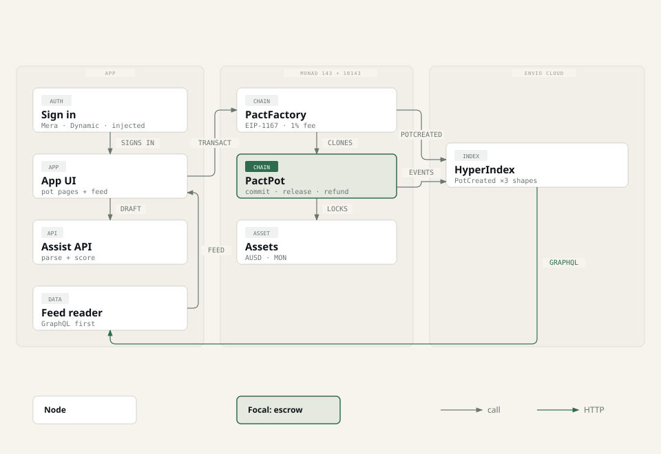

# WeMadeIt — money only moves if the group means it

**Live: https://wemadeit.vercel.app** · Track: **Consumer Products & Payments**
(Metropolis hackathon, Monad) · License: MIT.

## AI tooling disclosure

Per the Metropolis rules, this project was built with AI coding assistants
(OpenCode / opencode, powered by Claude and GPT-family models) for scaffolding,
refactors, and documentation. The smart contracts were written and reviewed by
the team; that review is our own — **no third-party audit has been performed**.
What we can substantiate: 16 Foundry tests covering the state machine, privacy,
fee invariants, and both refund paths; Sourcify `exact_match` verification
against the deployed bytecode on both chains; no external calls in the release or
refund paths beyond ERC-20 transfers and a static factory read.

Two runtime features call a real AI service — **TypeSafe** (Jev), used for
the "draft my pot" sentence parser and the legitimacy Noul badge:

- `POST /api/assist/parse` — one sentence → structured pot draft
- `POST /api/assist/score` — legitimacy judgment shown as a feed badge

No AI output can move funds. Contract release/refund paths are fully
deterministic, and the fee is read from the factory onchain rather than computed
by a model.

## Thesis

**Problem.** Every informal organizer knows the script: you front the Airbnb, the
dinner bill, the group gift — then spend two weeks chasing friends across Venmo
requests. Half pay late, some never do, and asking a fourth time makes *you* the
bad guy. Splitwise records the debt after the fact. WeTravel/SquadTrip are built
for professional tour operators, with custodial holds and weeks-long payouts —
overkill for six friends. Crowdtilt proved people *want* threshold-based group
funding, but its custodial cards and Venmo rails kept it from working.

**What.** WeMadeIt turns an informal promise ("yeah, I'm in") into **programmable
group intent**: the organizer names a rule — *$X each, N people, by Friday* — and
shares a link. Contributions lock in non-custodial escrow. Hit the rule and the
organizer can release the pot the moment it fills, and **anyone** can trigger
that release (**TILTED**) — no organizer action required. Miss it and everyone claims a
refund. **No tilt, no charge.**

**Why.** The failure isn't splitting — it's *commitment*. WeMadeIt answers "will
everyone actually pay?" *before* anyone is exposed, instead of documenting the
answer afterward.

**How (user flow).**
1. Organizer types one sentence *("cabin weekend, 6 of us, $80 each, by Friday")*
   → the form drafts itself → confirms → shares the link in the group chat.
2. Friends open the link, join with **Face ID** (no seed phrase, no app to
   install), see live faces + progress, and commit in one tap.
3. The progress bar *is* the reminder — social pressure replaces the awkward
   fourth text. Tilt → payout. Miss → one-tap refunds.

**Why now.** Three things converged: Monad makes $5–$50 conditional commits
economical (~$0.0001 actions, 600ms finality); passkeys (Mera) remove seed
phrases for normies; dollar stablecoins (AUSD, native OFT on Monad) remove
volatility from the conversation.

## Why Monad (genuine advantage, not a sticker)

- **Realtime social loop:** 400ms blocks mean commits land in under a second —
  the live progress bar that pressures the last two friends only works on fast
  finality.
- **Micro-escrow economics:** conditional $10 shares are viable at ~$0.0001 per
  action; on L1 gas they never were.
- **Passkeys + Mera:** Face ID derives a secp256k1 EOA on device with zero
  contracts, bundlers, or custody backend. The PRF output is turned into a
  BIP-39 seed, derived at `m/44'/60'/0'/0/0`, and opened as a signing session
  (`lib/mera.ts`). Note the curve is **secp256k1**, not P-256 — the Mera SDK
  exposes secp256k1 and Ed25519 sessions only, and the private key lives in page
  memory, never in storage.
- **AUSD (LayerZero OFT):** dollar-denominated pots; cross-chain friends bring
  the same dollar.
- **Envio HyperSync/HyperIndex:** realtime pot feed without running indexers
  (`indexer/`).

## Architecture



App (sign-in, UI, assist API, feed reader) · Monad 143 + 10143 (PactFactory →
PactPot clones holding AUSD/MON) · Envio HyperIndex (dynamic clone registration,
one GraphQL query for the feed). Full labeled version: [docs/architecture.html](docs/architecture.html).

## Contracts (Sourcify `exact_match`, both chains)

**Discovery:** the home feed is search + filter over public pots (invite-only
pots never listed; titles stay public onchain, joining requires the key).

State machine: `commit()` → full? `release()` (permissionless, pays organizer) :
deadline passes? `expire()` → `refund()` (pull pattern, per contributor).
**Visibility:** public pots join via `commit()`; invite-only pots enforce
`commitWithSecret()` — the secret lives in the share-link `#fragment` (never
sent to servers), the chain stores only its hash; organizers can rotate it via
`rotateSecret()`. Verified on testnet: open commit reverts (`PrivateUseSecret`),
keyed commit lands.
Security properties — the first four are covered by `forge test` (**16/16
green**): one commit per address; organizer cannot touch funds pre-tilt; **fee
(1%, capped 5%) is read from the factory onchain — callers cannot waive it**;
ReentrancyGuard + checks-effects throughout. Also enforced onchain: pot titles
capped at 120 **bytes** (`MAX_TITLE`, `PactFactory.sol:26`) — enforced in code
and mirrored byte-for-byte in the create form, but not currently asserted by a
test.

**Fee transparency.** A tilt charges 1% (set in the factory, `MAX_FEE_BPS` 5%), read
onchain at release time and surfaced in the UI *before* anyone commits — the release
button promises the exact net the payee receives, not the gross pot. Refunds are
free; a pot that misses its goal charges nothing.

No ceilings by design: party size and duration are unbounded (nothing loops over
them — a million-person fundraiser costs the same to create as a dinner pot).
Floors only: ≥2 people, amount above zero, deadline in the future.

| Chain | Factory (current, v6 — full history in `lib/monad.ts`) |
|---|---|
| Monad mainnet (143) | `0x910e17CC1Ea45B824E3Be700430E3F2cD29c5a4E` |
| Monad testnet (10143) | `0x2777C66CDE6C15D301cd0bf03C302b56E298e431` |

## Intelligence (TypeSafe, not hype)

Two narrow Jev judgments where semantics genuinely beat code; everything else
stays deterministic:

- **`POST /api/assist/parse`** — one sentence → structured draft. Closed sets
  (occasion, currency, deadline window) go to Jev as Choice questions; amounts
  and headcounts are extracted by regex in code; per-field confidence decides
  autofill vs. "please check" flags. Verified live: *"cabin weekend, 6 of us,
  $80 each, by Friday"* → trip / 3-day / 80 / 6.
- **`POST /api/assist/score`** — legitimacy Noul shown as a feed badge (cached
  per pot). Verified live: an ordinary trip pot scores **~0.9 "looks good"**,
  while *"FREE GIVEAWAY send 1 MON get 10 back"* scores **~0.03 "check
  details"**. The judgment is sampled per call, so treat the numbers as
  directional: what matters is the separation between an ordinary pot and a scam,
  which is stable across runs.

API keys stay server-side; both routes degrade gracefully and the manual form is
always the source of truth.

## Auth (three paths, one pot)

1. **Face ID** — Mera passkeys, no seed phrase.
2. **Log in** — Dynamic modal: email, Google, or 580+ wallets → embedded wallet
   synced into wagmi.
3. **Wallet app** — injected fallback when Dynamic is unconfigured.

## Vision & roadmap

WeMadeIt starts as the commitment layer for informal groups and grows into group
treasury infrastructure:

- **Now (hackathon):** MON pots, FaceID + email login, tilt/refund, live demo.
- **Next:** AUSD pots (cross-border groups, no volatility); recurring pots
  (club dues, rent splits); organizer reputation; Envio-powered public feed with
  legitimacy badges; laggard nudges.
- **Later:** creator payouts (fans tilt a project into existence); event stake
  pots (Kickback-style attendance, same escrow); agent payers (AI agents commit
  to pots via ERC-8004 identity + the same contracts).

**Business model:** 1% fee on tilted pots, shown to the user onchain before they
commit (onchain, capped at 5%), free under a threshold; pro tier for
clubs/creators (recurring pots, custom branding, analytics). Contra charges 0% and
monetizes elsewhere; WeTravel takes cuts plus holds — WeMadeIt is cheaper *and*
non-custodial.

## Bounty alignment

Four entries, each matched to what the code actually does.

- **Best Mera-Powered UX on Monad** — the whole product is the demo: open a
  link, Face ID, one tap to commit. No seed phrase, no extension, no chain
  jargon anywhere; the same passkey reproduces the account on every synced
  device (`category-labs/mera` SDK, BIP-39/44 derivation, session keys live
  only in page memory).
- **Best Use of Dynamic** — email/social login via embedded wallets synced into
  wagmi, so every pot action works identically regardless of login path; single
  Log in entry, opening spinner, provisioning states, and the native
  account-linking panel for identity management.
- **Best Use of Envio** — HyperIndex (`indexer/`, live on Envio Cloud) is
  configured for all six factory generations per chain, with dynamic clone
  registration (`contractRegister` on `PotCreated`) so each clone's `Committed`,
  `Tilted`, and `RefundingOpened` events are indexed per pot. All three
  `PotCreated` event shapes are handled (9-field v3+, 8-field v2/v4, 7-field
  v1) — `indexer/config.yaml` + `src/handlers/PactFactory{,V1,V2}.ts`. The
  public feed reads one GraphQL query instead of per-factory RPC enumeration,
  with automatic RPC fallback and a `via Envio` provenance tag. Live index
  currently holds rows for the current generation (verified by querying the
  GraphQL endpoint); `start_block` sits near head, so older pots are served by
  the feed's RPC union rather than the index.
- **Best Cross-Border Payments App on Monad (Agora, $10k)** — AUSD pots:
  canonical AUSD on mainnet (`0x0000…9012a`) and testnet (`0xa901…22dC`),
  6-decimal math end to end (create/approve/commit/display), Face ID
  onboarding, ~600ms settlement. **Verified on mainnet:** pot
  `0xc9bcfa820b46d0f3ec699e52566c988072f36984` was created with canonical AUSD,
  funded by two separate passkey accounts, reached its rule, and released
  0.2 AUSD to the payee — and being invite-only, it also demonstrates the
  private join-key path in production. Any organizer anywhere collects
  borderless dollars; contributors join with one tap and no seed phrase.

**Deliberately not entered: _Mera: One Passkey, Many Keys._** That bounty is scoped
to *non-account* use of Mera's PRF primitive — "anything that is NOT signing
blockchain transactions from a wallet account." Our PRF derivation has exactly one
purpose: deriving the EOA that signs pot transactions (`lib/mera.ts` → BIP-39 →
`m/44'/60'/0'/0/0` → secp256k1 signing session). That is wallet-account signing, which
is the subject of the Mera UX bounty above. Rather than claim a bounty the
implementation doesn't meet, we left it out. Earning it would mean deriving non-wallet
material from the PRF — e.g. a shared secret that encrypts invite secrets client-side
before they ever reach a URL fragment.

## Run locally

```bash
cd contracts && forge test                      # 16/16
cd app && pnpm install && pnpm dev              # needs env below
cd app && pnpm typecheck && pnpm lint && pnpm test   # CI checks
```

`pnpm lint` enforces `react-hooks/rules-of-hooks` as an error. This is deliberate:
the pot page crashed in production twice from hooks sitting below an early return,
which TypeScript cannot catch. `pnpm test` pins the pot page's read-derivation against
the data shapes it actually receives (empty, partial, modern pot, and pre-v2 pots
whose `title()`/`isPrivate()` revert).

Env (names only — values in `.env.local`, never committed):

| Var | Scope | Purpose |
|---|---|---|
| `NEXT_PUBLIC_CHAIN` | public | first-visit default chain (`mainnet` in production; local `.env.example` uses `testnet`) |
| `NEXT_PUBLIC_DYNAMIC_ENV_ID` | public identifier | Dynamic login (abuse controlled by dashboard allowlists, not secrecy) |
| `NEXT_PUBLIC_MONAD_MAINNET_RPC` | public | QuickNode Pro endpoint (mainnet) |
| `NEXT_PUBLIC_MONAD_TESTNET_RPC` | public | QuickNode Pro endpoint (testnet) |
| `NEXT_PUBLIC_ENVIO_URL` | public | Envio Cloud GraphQL (feed; RPC fallback when unset) |
| `TYPESAFE_API_KEY` | **server secret** | assist routes; never `NEXT_PUBLIC_` |

Factories + AUSD are canonical constants in `lib/monad.ts` — no env needed.

Vercel: Root Directory `app`, push-to-main auto-deploys.

## Demo (3 min)

1. "Who fronted a trip and got ghosted?" 2. Type one sentence → form drafts
   itself → create + share link. 3. Two phones FaceID-commit live. 4. Third
   commits → **WE MADE IT 🎉** fills the screen + explorer tx — say it with
   the room. 5. Expired pot → refund claimed live. 6. Close: "Splitwise
   records debt. WeMadeIt prevents it."
